# what is hooks ? 
- hooks are special functions, that allow use state and other react features in functional components.
- Earlier, when we used to create react app using Function component, then we didn't have access to the state management and lifecycle methods.
To access these features we had to add class components.
- so this was the problem with functional component.
- But after introducing React hooks from version 16.8, we can now use state management and other react features without writing class components.
- In other words, Hooks are the functions that make functional components work like class components.

What are the rules of hooks ?
1. Only call hooks at the top level and from react functional components.

Commonly Used Hooks:
- State Hooks (useState, useReducer)
- Effect Hooks (useEffect): Interact with external systems (e.g., API calls).
- Ref Hooks (useRef): Access DOM elements.

- useMemo, useCallback, useContext,useLayoutEffect, custom hook

## useState 
- useState is a react hook, which creates an "state variable". which helps us to track state in components and updates the user interface when state changes.
- useState returns an array with two elements. The first element is the current state value, and the second element is a function that lets you update it.
- useState is a named export from the react package.
- useState is a function that takes one argument, the initial state value, and returns an array with two elements.

### why useState is used ? 
=> example, 
```jsx
import { useState } from "react";
import "./App.css";

function App() {
	let color = "Red"
	const changeColor = () =>{
		color = "Blue"
		console.log(color)
	}
	return (
		<>
		<h1>My favorite color is {color}!</h1>
		<button onClick={changeColor}>Blue</button>
		</>
	)
}

export default App;
```


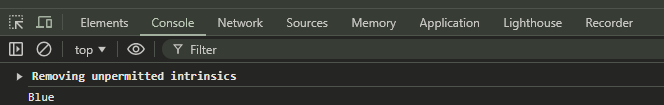

the images and codes shows why, we need useState hook. because, after making the button click, the color is not changing.

so, to solve this problem, we need to use useState hook.

```jsx
import { useState } from "react";
import "./App.css";

function App() {
	const counter = useState(0) // 0 is the initial value of the state variable. 
	console.log(counter) // [0, f] => 0 is the current state value, and f is the function that lets you update it.
    // or we can write like that... 

    const counter = useState(0)[0]
    const setCounter = useState(0)[1]


	let color = "Red"
	const changeColor = () =>{
		color = "Blue"
		// console.log(color)
	}
	return (
		<>
		<h1>My favorite color is {color}!</h1>
		<button onClick={changeColor}>Blue</button>
		</>
	)
}

export default App;

```

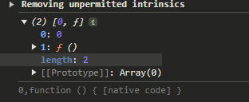

- Now, move to the next step, to use it effectively and efficiently syntax.
so, use array, of 2 elements to store the state variable and the function that updates it.

```jsx
import { useState } from "react";
import "./App.css";

function App() {
	const [counter, setCounter] = useState(10)
	console.log(counter)

	let color = "Red"
	const changeColor = () =>{
		color = "Blue"
		// console.log(color)
	}
	return (
		<>
		<h1>My favorite color is {color}!</h1>
		<button onClick={changeColor}>Blue</button>
		</>
	)
}

export default App;

```
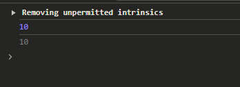

```jsx
import { useState } from "react";
import "./App.css";

function App() {
	const [color, setColor] = useState("Red") 
	
	const changeColor = () =>{
		setColor("Blue")
	}
	return (
		<>
		<h1>My favorite color is {color}!</h1>
		<button onClick={changeColor}>Blue</button>
		</>
	)
}

export default App;

```
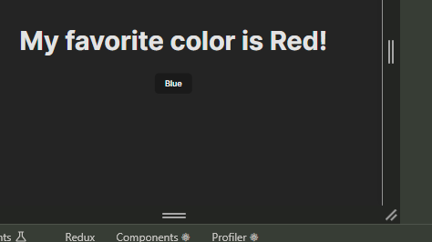

and when i click on button, it change the color from red to blue.

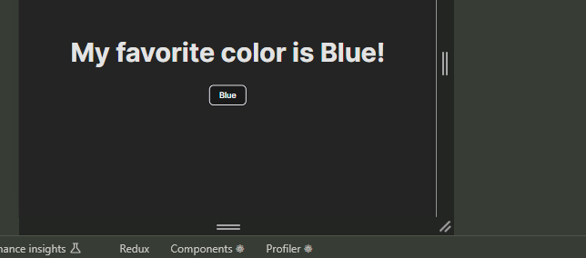

Now, play with multiple state variables

```jsx
import React,{useState} from 'react'

import './App.css';

function App() {
  const [brand, setBrand] = useState('ford') // multiple state variables 
  const [model, setModel] = useState('mustang')
  const [color, setColor] = useState('red')
  const [year, setYear] = useState(1964)

  return (
    <>
    <h1>my {brand}</h1>
    <h2>It is a {color} {model} from {year}</h2>
    </>
  );
}

export default App;
```

- instead of multiple state variables, we can use object to store the state variables as key-value pairs.

```jsx

import React,{useState} from 'react'

import './App.css';

function App() {
  const [car, setCar] = useState({ // key value pair
    brand: 'ford',
    model: 'mustang',
    color: 'red',
    year: 1964
  })

//   const changeColor = () => {
// 	setCar((prev)=>{
// 		return {...prev,color:'blue'}
// 	})
//   }

    const changeColor = () =>{
    setCar({...car, color: 'blue'}) 
  }

  return (
    <>
    <h1>my {car.brand}</h1>
    <h2>It is a {car.color} {car.model} from {car.year}</h2>
    <button onClick={changeColor}>blue</button>
    </>
  );
}

export default App;
```

### let's move on to the next example of useState which is counter button :)

-  increase by 1

```jsx
import React,{useState} from 'react'

import './App.css';

function App() {
  const [count,setCount] = useState(0)
  const increaseCount = () =>{
    setCount(count+1) 
  }
  return (
    <>
    <h1>count : {count}</h1>
    <button onClick={increaseCount}>Increment value</button>
    </>
  );
}

export default App;

```

- increase by 4 ? 

```jsx
import React,{useState} from 'react'

import './App.css';

function App() {
  const [count,setCount] = useState(0)
  const increaseCount = () =>{
    setCount(count+1) // 1 - it take initial value of count
    setCount(count+1) // 1 - it take initial value of count
    setCount(count+1) //1 - it take initial value of count
    setCount(count+1) //1 - it take initial value of count
  }
  return (
    <>
    <h1>count : {count}</h1>
    <button onClick={increaseCount}>Increment value</button>
    </>
  );
}

export default App;

```

### use previous state value for updating the state variable

```jsx
import React,{useState} from 'react'

import './App.css';

function App() {
  const [count,setCount] = useState(0)
  const increaseCount = () =>{
    setCount((prev)=>prev+1) // 0+1 = 1
    setCount((prev)=>prev+1) // 1+1 = 2
    setCount((prev)=>prev+1) // 2+1 = 3
    setCount((prev)=>prev+1) // 3+1 = 4
    // prev is the previous value of count and it is used to update the value of state 

  }
//   const increaseCount = () =>{
//     setCount(count+4)
//   }
  return (
    <>
    <h1>count : {count}</h1>
    <button onClick={increaseCount}>Increment value</button>
    </>
  );
}

export default App;

```

- prev is important to use, because it is used to update the state variable

# useEffect Hook 
- useEffect Hook allows you to perform side effects in your components
=> example : example of side effect is 
- fetching data from an API
- updating the DOM directly
- setting up a subscription
- Timers like SetTimeOut and SetInterval

1. import from react library
2. useEffect is a function that takes two arguments, a callback function and an array of dependencies (optional)
### 
ways to use useEffect (syntax)
1. useEffect(cb)
2. useEffect(cb, [])
3. useEffect(cb, [dependencies]) : useEffect(cb,[count,name,age,etc])

 ### example of useEffect - display a counter, that will how many times counter will loaded.

```jsx
import React,{useState, useEffect} from 'react'

import './App.css';

function App() {
  const [count, setCount] = useState(0)
  useEffect(()=>{ 
    setTimeout(()=>{
      setCount(prev => prev + 1) 
    },2000) // 2 seconds
  })
  return (
    <>
      <h1>I've rendered {count} times!</h1>
    </>
  );
}

export default App;

```

- Here is problem, it increase value from 0 to 2 directly, instead of 0 to 1, so, for this, just remove strict mode (`<React.StrictMode>`) from index.js file

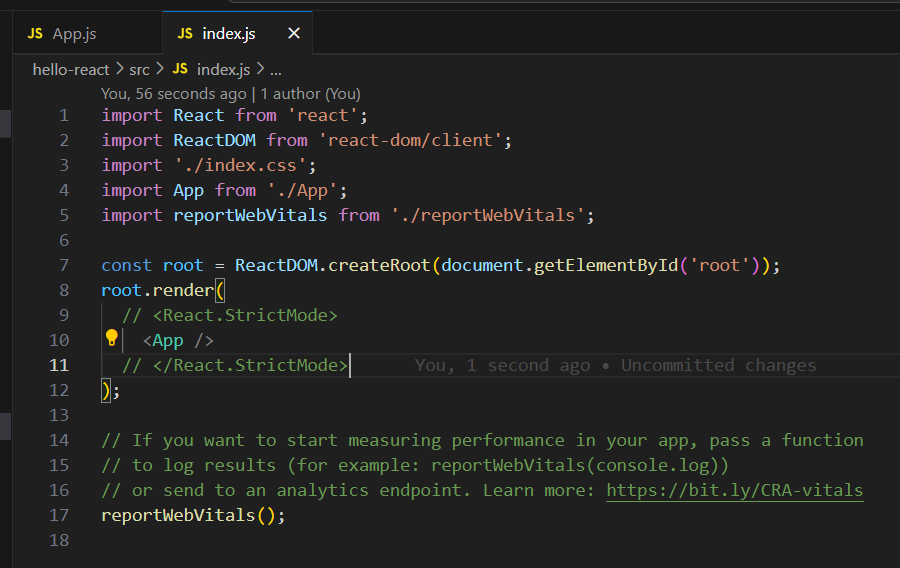


comment out the strict mode from index.js file, and now, it will increase the value from 0 to 1 and so on.

## why this increase value continuously ?
- because, we are using useEffect without any dependencies, so it will run on every render, and it will increase the value of count.
- so, when we use useEffect without any dependencies, it will execute the call back function whenever the any state change in this component.
- so, the count state is changing in every 2 seconds and when the count state is changing it will again execute this callback function, so, it will increase the value of count continuously in every 2 seconds and update the count value state.

### 2nd example of useEffect - add dependencies, empty array 

```jsx
import React,{useState, useEffect} from 'react'

import './App.css';

function App() {
  const [count, setCount] = useState(0)
  useEffect(()=>{
    setTimeout(()=>{
      setCount(prev => prev + 1)
    },2000)
  },[])
  return (
    <>
      <h1>I've rendered {count} times!</h1>
    </>
  );
}

export default App;

```
- in empty array, useEffect will run only once, when the component is mounted, and it will not run again, because we have passed empty array as a second argument to useEffect.

### 3rd example of useEffect - add dependencies, array of count 

```jsx
import React,{useState, useEffect} from 'react'

import './App.css';

function App() {
  const [count, setCount] = useState(0)
  useEffect(()=>{
    setTimeout(()=>{
      setCount(prev => prev + 1)
    },2000)
  },[count])
  return (
    <>
      <h1>I've rendered {count} times!</h1>
    </>
  );
}

export default App;

```

- in this example, useEffect will run whenever the count state changes, because we have passed count as a dependency to useEffect.

### 4th example of useEffect - add dependencies, array of count and other state variables

```jsx
import React,{useState, useEffect} from 'react'

import './App.css';

function App() {
  const [count, setCount] = useState(0)
  const [name, setName] = useState('ar lab')
  useEffect(()=>{
    setTimeout(()=>{
      setCount(prev => prev + 1)
    },2000)
  },[count,name])
 // console.log(name)   
  return (
    <>
      <h1>I've rendered {count} times!</h1>
    </>
  );
}

export default App;

```

# useRef Hook

- useRef is react hook that allow us to create mutable variables, which will not re-render the component

- useRef is a react hook, which is used to access the DOM elements and also modified it and store the mutable value

=> example : create a count and display how many times it's re-rendered

```jsx
import React,{useState, useEffect, useRef} from 'react'

import './App.css';

function App() {
  const [value, setValue] = useState(0)
  const [cnt, setCnt] = useState(0)
  useEffect(()=>{
    setCnt(prev => prev+1)
  })
  return (
    <>
      <button onClick={()=>setValue(prev => prev-1)}>-1</button>
      <h1>{value}</h1>
      <button onClick={()=>setValue(prev => prev+1)}>+1</button>
      <h1>{cnt}</h1>
    </>
  );
}

export default App;

```
- cnt is increase continuously, because, it is re-rendering the component, so, to solve this problem, we need to use useRef hook.


```jsx
import React,{useState, useEffect, useRef} from 'react'

import './App.css';

function App() {
  const [value, setValue] = useState(0)
  // const [cnt, setCnt] = useState(0)
  const cnt = useRef(10)
  console.log(cnt)
  // useEffect(()=>{
  //   setCnt(prev => prev+1)
  // })
  return (
    <>
      <button onClick={()=>setValue(prev => prev-1)}>-1</button>
      <h1>{value}</h1>
      <button onClick={()=>setValue(prev => prev+1)}>+1</button>
      {/* <h1>{cnt}</h1> */}
    </>
  );
}

export default App;

```
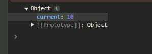

- useRef is used as current property, so, to access the current value of the ref, we need to use current property.


```jsx
import React,{useState, useEffect, useRef} from 'react'

import './App.css';

function App() {
  const [value, setValue] = useState(0)
  const cnt = useRef(0)
  useEffect(()=>{
    cnt.current +=1
  })
  return (
    <>
      <button onClick={()=>setValue(prev => prev-1)}>-1</button>
      <h1>{value}</h1>
      <button onClick={()=>setValue(prev => prev+1)}>+1</button>
      <h1>{cnt.current}</h1>
    </>
  );
}

export default App;

```
- cnt is not increasing continuously, because, we are using useRef hook, so, it will not re-render the component, and it will not increase the value of cnt continuously.
- useRef is used to store the mutable value, and it will not re-render the component.
- useRef is used to access the DOM elements and also modified it.

### let's take example of useRef to access the DOM elements

```jsx
import React,{useState, useEffect, useRef} from 'react'

import './App.css';

function App() {
  const inputElement = useRef() // create a reference to input field
  const btnClicked = () =>{  
    console.log(inputElement.current)  
    inputElement.current.style.backgroundColor = 'red' // change the background color of input field
  }
  return (
    <>
    <input type="text" ref={inputElement} /> {/* assign the reference to input field */}
    <button onClick={btnClicked}> clicked me</button> {/* button to change the background color of input field */}
    </>
  );
}

export default App;

```

# useContex Hook

- useContext is a react hook that allows you access data from any component without explicitly passing it down through props at every level

- useContext is used to manage Global data in the React App

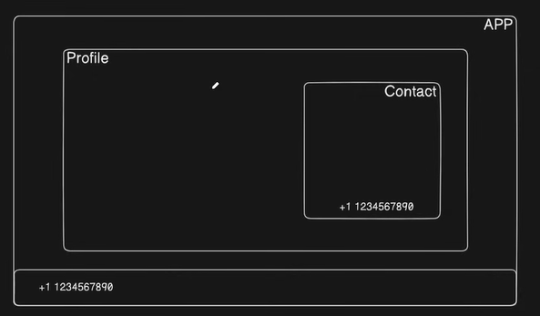

- the image shows the problem, when we have to pass the data from parent to child component, so, to solve this problem, we need to use useContext hook.
- managing and updating the data is difficult, when we have to pass the data from parent to child component, so, to solve this problem, we need to use useContext hook.

## 3 steps to use useContext hook
1. create a context
2. provide the context
3. consume the context

### example of useContext hook
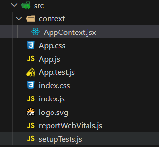
```jsx
import { createContext } from "react"

export const AppContext = createContext()

const ContextProvider = (props) => {
    const phone = "+2 123 456 7890"
    const name = "ar lab"
    return(
        <AppContext.Provider value={{phone,name}}>
            {props.children}
        </AppContext.Provider>
    )
}

export default ContextProvider

```
```jsx
import logo from './logo.svg'
import './App.css'
import Profile from './components/Profile'
import Footer from './components/Footer'

function App() {
  return (
    <>
       <Profile/>
       <Footer/>
    </>
  );
}

export default App;

```
```jsx
import React from 'react';
import ReactDOM from 'react-dom/client';
import './index.css';
import App from './App';
import reportWebVitals from './reportWebVitals';
import ContextProvider from './context/AppContext';

const root = ReactDOM.createRoot(document.getElementById('root'));
root.render(
  <ContextProvider>
    <React.StrictMode>
    <App />
  </React.StrictMode>
  </ContextProvider>
  
);

reportWebVitals();

```

```jsx
import React, { useContext } from 'react'
import { AppContext } from '../context/AppContext'

const Footer = () => {
    const {phone,name} = useContext(AppContext) 
  return (
    <div>
        <h2>Footer</h2>
        <h3>Phone : {phone}</h3>
        <h3>Name : {name}</h3>
    </div>
  )
}

export default Footer
```

```jsx
import React from 'react'
import Contact from './Contact'

const Profile = () => {
  return (
    <div>
        <h1>Profile</h1>
        <Contact/> 
    </div>
  )
}

export default Profile
```

```jsx
import React, { useContext } from 'react'
import { AppContext } from '../context/AppContext'

const Contact = () => {
    const {phone,name} = useContext(AppContext)

  return (
    <div>
        <h2>Contact</h2>
        <h3>Phone : {phone}</h3>
        <h3>Name : {name}</h3>
    </div>
  )
}

export default Contact

```

- just follow above mention 3 steps and you will be able to use useContext hook in your react app.
- Note : AppContext.jsx file is import for syntax

# useReducer 
- useReducer is similar to useState, but instead of providing state and setter function, it provide state and dispatch function.
- The useReducer hook is accepts 2 arguments
1. reducer function
2. initial state
- and returns : current state and dispatch function
- The reducer function specifies how the state gets updated.

```jsx
import { useReducer } from 'react';
import './App.css'
import { type } from '@testing-library/user-event/dist/type';


function App() {
  const initialState = {count : 0}
  const reducer = (state, action) => {
    switch(action.type){
      case 'increase':
        return {count : state.count + 1}
      case 'decrease':
        return {count : state.count -1}
      default:
        return state

    }
  }
  const [state,dispatch] = useReducer(reducer, initialState)

  return (
    <>
       <h1>count is : {state.count}</h1>
       <button onClick={()=>dispatch({type : 'increase'})}>increase</button> 
       <button onClick={()=>dispatch({type : 'decrease'})}>decrease</button>
    </>
  );
}

export default App;

```

- we can add more action type, as data as payload

```jsx
import { useReducer } from 'react';
import './App.css'
import { type } from '@testing-library/user-event/dist/type';


function App() {
  const initialState = {count : 0}
  const reducer = (state, action) => {
    switch(action.type){
      case 'increase':
        return {count : state.count + 1}
      case 'decrease':
        return {count : state.count -1}
      case 'input':
        return {count : action.payload}
      default:
        return state
    }
  }
  const [state,dispatch] = useReducer(reducer, initialState)

  return (
    <>
       <h1>count is : {state.count}</h1>
       <button onClick={()=>dispatch({type : 'increase'})}>increase</button> 
       <button onClick={()=>dispatch({type : 'decrease'})}>decrease</button>
       <br>
       </br>
       <input value={state.count} onChange={(e)=>dispatch({type: 'input',payload:Number(e.target.value)})} type='number'/>  
    </>
  );
}
export default App;
```

# useMemo Hook 
- The React useMemo Hook returns a memoized value. (it's like caching a value so that it doesn't need to be recalculated)
- The useMemo Hook only runs when one of its dependencies gets updated
- This can improve the performance of the application. There is one more hook in react to improve performance, that is useCallback hook.
- Both are similar but the difference is that useMemo returns a memoized value and useCallback returns a memoized function.

```jsx
import React, { useState } from 'react'

const App = () => {
  const [number, setNumber] = useState(0)
  const [counter, setCounter] = useState(0)
  function cubeNum(num){
    console.log('Calculation done!')
    return Math.pow(num,3)
  }
  const result = cubeNum(number)

  return (
    <div>
      <input type='number' value={number} onChange={(e)=>{setNumber(e.target.value)}} />
      <h1>cube of the number : {result}</h1>
      <button onClick={()=>{setCounter(counter+1)}}>counter ++</button>
      <h1>Counter : {counter}</h1>
    </div>
  )
}

export default App
```

- in the above example, when we change the input field, the cubeNum function will run, and it will re-calculate the cube of the number, so, to solve this problem, we need to use useMemo hook.

```jsx
import React, { useMemo, useState } from 'react'

const App = () => {
  const [number, setNumber] = useState(0)
  const [counter, setCounter] = useState(0)
  function cubeNum(num){
    console.log('Calculation done!')
    return Math.pow(num,3)
  }
  const result = useMemo(()=>cubeNum(number),[number]) // useMemo will only re-calculate the value when the number changes, not at counter button 

  return (
    <div>
      <input type='number' value={number} onChange={(e)=>{setNumber(e.target.value)}} />
      <h1>cube of the number : {result}</h1>
      <button onClick={()=>{setCounter(counter+1)}}>counter ++</button>
      <h1>Counter : {counter}</h1>
    </div>
  )
}

export default App
```

# useCallback Hook

- useCallback is a React Hook that lets you cache a function definition between re-renders.
- It means, when we use the useCallback hook, it doesn't create multiple instance of same function when re-render happens.
- instead of creating new instance of the function, it provides the cached function on re-render of the component.

```jsx
import React, { useMemo, useState } from 'react'
import Header from './components/Header'

const App = () => {
 
  const [count, setCount] = useState(0)
  
  return (
    <>
    <Header/>
    <h1>{count}</h1> 
    <button onClick={()=>setCount(prev=>prev+1)}>click here</button>
    </>
  )
}

export default App
```

```jsx
import React from 'react'

const Header = () => {
    console.log('Header rendered')
  return (
    <div>
        <h1>Header</h1>
    </div>
  )
}

export default Header
```
- in the above example, when we click on button, the header component will re-render, so, to solve this problem, we need to use useCallback hook.
- we are mounted Header in app.js file, so, when we click on button, the header component will re-render, so, to solve this problem, we need to use useCallback hook.
- so, use memo method to solve this problem.
  
```jsx
import React from 'react'

const Header = () => {
    console.log('Header rendered')
  return (
    <div>
        <h1>Header</h1>
    </div>
  )
}

export default React.memo(Header) // use memo method to solve this problem
```


- now, create new function at app.js file and pass it to the header component.

```jsx
import React, { useMemo, useState } from 'react'
import Header from './components/Header'

const App = () => {
 
  const [count, setCount] = useState(0)
  const newFn = () =>{}
  
  return (
    <>
    <Header newFn={newFn}/>
    <h1>{count}</h1> 
    <button onClick={()=>setCount(prev=>prev+1)}>click here</button>
    </>
  )
}

export default App
```

- now, it again re-render the header component. and it's happens because of referential equality. 

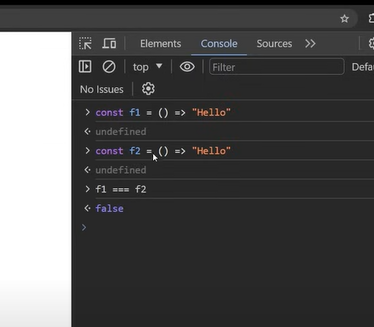
it gives us false, because both function create different memory location.

- so, props are changes and header component will re-render, so, to solve this problem, we need to use useCallback hook.


```jsx
import React, { useCallback, useState } from 'react'
import Header from './components/Header'

const App = () => {
 
  const [count, setCount] = useState(0)

  const newFn = useCallback(()=>{},[]) // useCallback will cache the function and it will not re-render the header component.
   
  return (
    <>
    <Header newFn={newFn}/>
    <h1>{count}</h1> 
    <button onClick={()=>setCount(prev=>prev+1)}>click here</button>
    </>
  )
}

export default App

```
```jsx
import React, { useCallback, useState } from 'react'
import Header from './components/Header'

const App = () => {
 
  const [count, setCount] = useState(0)

  const newFn = useCallback((count)=>{},[count]) // we pass dependencies to useCallback, so, it will re-render the header component when the count state changes.
  
  return (
    <>
    <Header newFn={newFn}/>
    <h1>{count}</h1> 
    <button onClick={()=>setCount(prev=>prev+1)}>click here</button>
    </>
  )
}

export default App

```

# useLayoutEffect Hook

- useLayoutEffect is similar to useEffect, but it is called before the user interface gets mounted.
- useEffect is called after the printing the DOM elements. useLayoutEffect gets called before printing the DOM elements.

```jsx
import React, { useEffect, useLayoutEffect } from 'react'

const App = () => {
  useEffect(()=>{
    console.log('message from useEffect')
  })
  useLayoutEffect(()=>{
    console.log('message from useEffectLayout')
  })
  return (
    <>
    <h1>Test message</h1>
    </>
  )
}

export default App
```
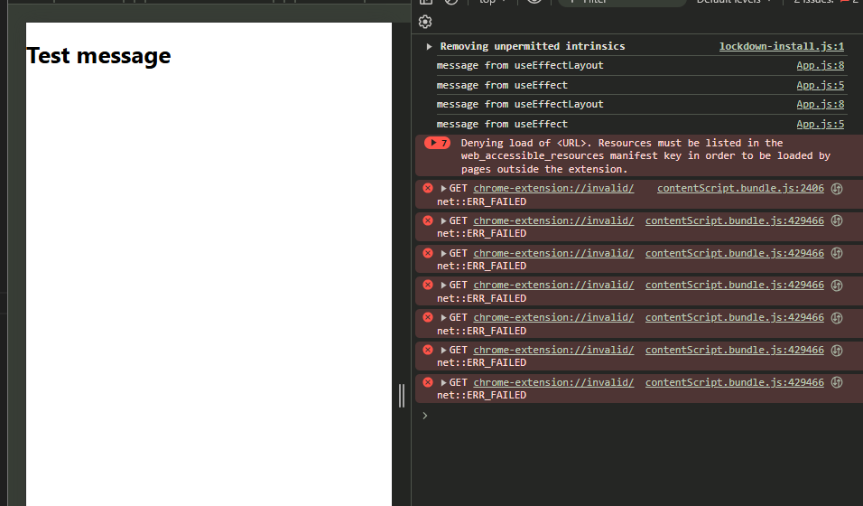

- flow of execution : useLayoutEffect -> h1 -> useEffect

let's take another example of useLayoutEffect hook with array of timing... 

```jsx
import React, { useEffect, useLayoutEffect } from 'react'

const App = () => {
  useEffect(()=>{
    console.log('message from useEffect')
  })
  useLayoutEffect(()=>{
    console.log('message from useEffectLayout')
  })
  return (
    <>
    <h1>Test message</h1>
    {
      Array(40000).fill('').map((item,index)=>(<li key={index}>{Math.pow(Math.random(),10)}</li>)) 
    }
    </>
  )
}

export default App
```
- we can use useLayoutEffect hook for measuring the DOM elements, and animating the elements and for fixing the flickering issue and we can also use it for API calling but it is not recommended so, use useEffect hook as you can. 


```jsx
const addToCard = (product) => {
    const existingProduct = state.products.find(p => p.id === product.id);
    let updatedCart;
    if (existingProduct) {
        updatedCart = state.products.map(p => 
            p.id === product.id ? { ...p, quantity: p.quantity + 1 } : p
        );
    } else {
        updatedCart = [...state.products, { ...product, quantity: 1 }];
    }
    updatePrice(updatedCart);
    dispatch({
        type: "update cart",
        payload: updatedCart
    });
};

const removeToCard = (product) => {
    const existingProduct = state.products.find(p => p.id === product.id);
    let updatedCart;
    if (existingProduct.quantity > 1) {
        updatedCart = state.products.map(p => 
            p.id === product.id ? { ...p, quantity: p.quantity - 1 } : p
        );
    } else {
        updatedCart = state.products.filter(p => p.id !== product.id);
    }
    updatePrice(updatedCart);
    dispatch({
        type: "update cart",
        payload: updatedCart
    });
};
```