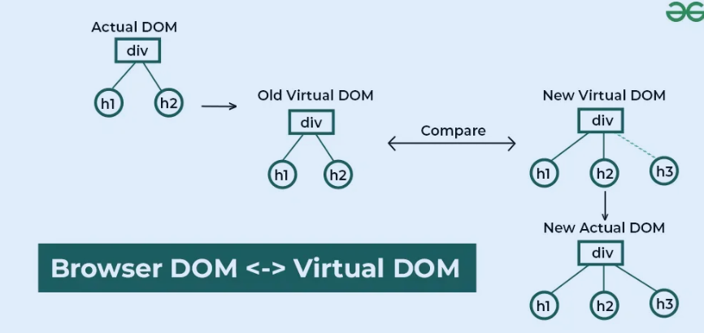

### **Guide to React.js Reconciliation, Virtual DOM, and Diffing Algorithm**

React.js uses smart techniques like the **Virtual DOM**, **Reconciliation**, and the **Diffing Algorithm** to make your app fast and efficient. 

---

## **1. Virtual DOM (VDOM)**

The **Virtual DOM** is React’s **magic mirror** of your web page. It’s a lightweight **copy** of the real DOM (the one browsers use to display web pages).

### **Why Do We Need It?**

Updating the real DOM is **slow** because the browser has to calculate layouts, styles, and redraw the page. React uses the Virtual DOM to figure out the smallest changes needed in the real DOM, making updates faster.

### **How It Works :**

1. React keeps a **Virtual DOM** to track how your UI should look.
2. When something changes (like user input), React:
    - Updates the Virtual DOM first.
    - Compares the updated Virtual DOM with the old one (using the **Diffing Algorithm**).
    - Calculates the **minimum number of changes** needed.
3. React applies those changes to the **real DOM**.

---

### **ELI5 Explanation of the Virtual DOM**

Imagine your real DOM is a big whiteboard full of drawings. Changing one part means **erasing and redrawing the entire board**—a slow process.

The Virtual DOM is like a **piece of paper** where React drafts changes. React only erases/redraws the **exact spots** needed on the whiteboard, saving time.

---

## **2. Reconciliation**

Reconciliation is the **process React uses to update the DOM** when your app's data changes. It involves:

1. Comparing the old Virtual DOM and the new Virtual DOM.
2. Figuring out what’s different.
3. Updating only the changed parts in the real DOM.

---

### **ELI5 Explanation of Reconciliation**

Imagine you’re editing a book. Instead of reprinting the entire book when one word changes, React reads both the old and new drafts, finds the exact word that changed, and only replaces that.

---

## **3. Diffing Algorithm**

React’s **Diffing Algorithm** is the smart process it uses to compare the old and new Virtual DOMs efficiently. Instead of comparing every single node, React uses clever tricks to save time.

---

### **How Does Diffing Work?**

1. **Same Type of Element**:
    - If two elements have the same type (like `<div>` to `<div>`), React keeps the element and updates its attributes.
    - Example:
    React will just update the `id` without replacing the whole `<div>`.
        
        ```jsx
        // Before
        <div id="old" />
        // After
        <div id="new" />
        ```
        
2. **Different Types of Elements**:
    - If two elements have different types, React removes the old element and creates a new one.
    - Example:
    React will replace the `<div>` with a `<span>`.
        
        ```jsx
        // Before
        <div />
        // After
        <span />
        
        ```
        
3. **Lists and Keys**:
    - When dealing with lists (like rendering an array of items), React uses **keys** to identify which items have changed, been added, or been removed.
    - Without keys, React re-renders the entire list.

---

### **Why Is the Diffing Algorithm Fast?**

- React assumes **elements at the same level** of the tree are similar. It doesn’t check deeper until needed.
- This reduces the number of comparisons from **O(n³)** (super slow) to **O(n)** (fast!).

---

### **ELI5 Explanation of Diffing**

Imagine you’re comparing two Lego models to find differences:

- If two Lego blocks are the same color and shape, you leave them alone.
- If a block is different (wrong color or missing), you replace it.
- You don’t check every Lego block individually—you only check where changes might have happened.

---

## **4. Putting It All Together**

When React updates your UI:

1. **Virtual DOM**:
    - React creates a draft (new Virtual DOM) and compares it with the previous one.
2. **Reconciliation**:
    - React uses the **Diffing Algorithm** to find what changed.
3. **Real DOM**:
    - React applies only the necessary changes to the real DOM.

---

### **Example of How React Optimizes DOM Updates**

Here’s a small example showing React’s optimization process:

```jsx
function App() {
  const [count, setCount] = React.useState(0);

  return (
    <div>
      <h1>Hello</h1>
      <p>Count: {count}</p>
      <button onClick={() => setCount(count + 1)}>Increment</button>
    </div>
  );
}

```

- When you click the button, React:
    1. Updates the Virtual DOM with the new count value.
    2. Compares the old `<p>` with the new one (`<p>Count: 0` → `<p>Count: 1`).
    3. Updates **only the `<p>` tag** in the real DOM.

---

## **5. Why This Matters for Developers**

Understanding React’s Virtual DOM, Reconciliation, and Diffing helps you:

- Write faster and more efficient apps.
- Avoid unnecessary renders by using **keys** and proper state management.
- Debug performance issues by knowing how React updates the DOM.

---

### **Tips for Efficient React Apps**

1. **Use Keys in Lists**:
    
    ```jsx
    const items = ["a", "b", "c"];
    items.map((item, index) => <div key={index}>{item}</div>);
    
    ```
    
    Keys help React identify which items changed in a list.
    
2. **Memoization**:
    
    Use `React.memo` or `useMemo` to skip re-rendering parts of your UI that don’t change.
    
3. **Avoid Over-Nesting**:
    
    Deeply nested components can increase reconciliation time. Keep your components simple.
    
